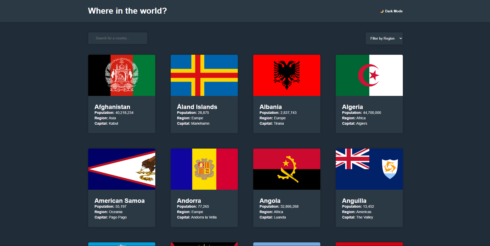
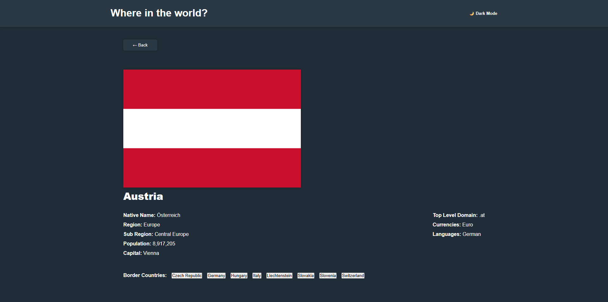
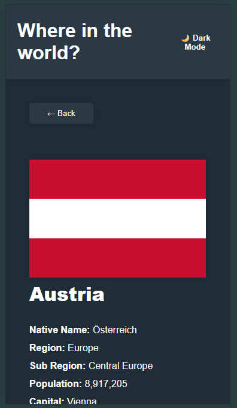

<p align="center"><h1>REST Countries API</h1></p>
This is my solution to the [REST Countries API with color theme switcher challenge on Frontend Mentor.](https://www.frontendmentor.io/challenges/rest-countries-api-with-color-theme-switcher-5cacc469fec04111f7b848ca)

## Table of contents

- Overview

  - The challenge
  - Live Demo

- My process

  - Built with
  - Resources
  - Reflection

## Overview

### The Challenge
Users should be able to:

- See all countries from the API on the homepage
- Search for a country using an input field
- Filter countries by region
- Click on a country to see more detailed information on a separate page
- Click through to the border countries on the detail page
- Toggle the color scheme between light and dark mode (optional)

### Live Demo
Live Demo URL: https://s57863b.github.io/REST-Countries-API-project/

### Screenshot





## My Process

### Built with
- HTML5
- CSS3
- JavaScript (ES6+)
- TypeScript
- API provided by FrontEnd Mentor
- Node.js

### Resources
- MDN
- W3Schools
- Fronend Mentor Challenge
- Module 5 & 6 (Per Scholas)

My code I want to highlight

```
private showHomePage(countries: Country[]) {
    // 1. Renders the static layout (search bar, filters) only once
    this.ui.renderHomePageLayout();
    
    // 2. Renders the dynamic grid of country cards
    this.ui.renderCountriesList(countries, (code) => this.showDetailPage(code));
    
    // 3. Performance Optimization: Prevents duplicate event listeners
    if (!this.listenersAttached) {
      this.setupSearchAndFilter();
      this.listenersAttached = true;
    }
  }

  private showDetailPage(code: string) {
    const country = this.allCountries.find(c => c.alpha3Code === code);
    
    if (country) {
      // 4. SPA Routing: Passing callbacks to handle navigation without reloading
      this.ui.renderDetailPage(
        country,
        this.allCountries,
        () => this.showHomePage(this.allCountries), // Callback for the 'Back' button
        (newCode) => this.showDetailPage(newCode)   // Recursive callback for Border Countries
      );
    }
  }
```